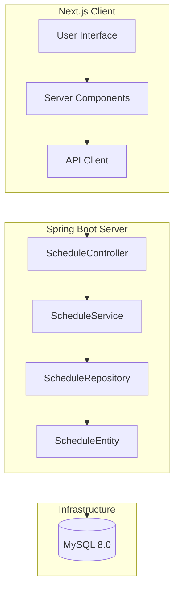
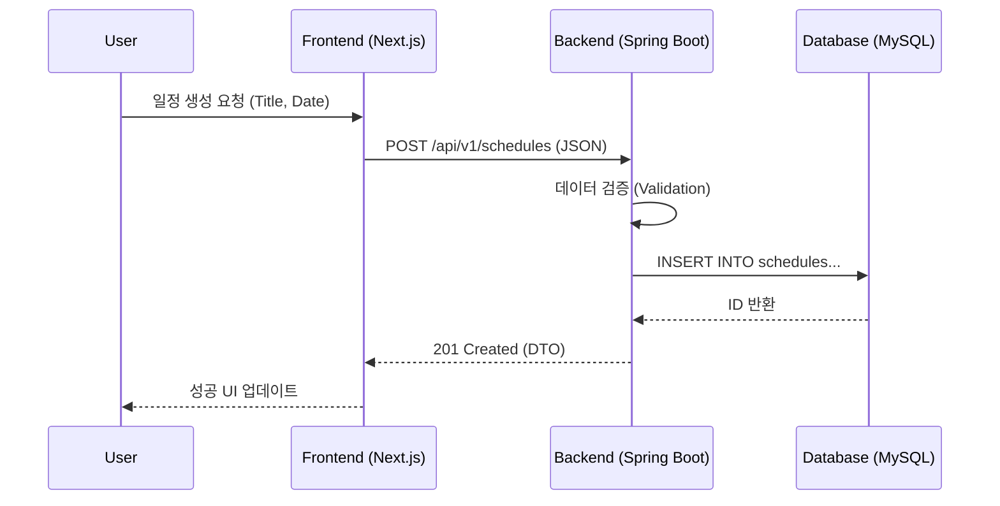

# [LOG] Dopyeonsu Architect Decision
- **Decision**: 3-Tier Layered Architecture with Domain-Driven Design (DDD) principles.
- **Rationale**: To ensure scalability and separation of concerns between business logic and infrastructure.
- **Design Pattern**: Repository Pattern for data access, DTO for data transfer.

# Madang-Schedule v2: High-Level Architecture

## 1. System Topology (UML)

## 2. Dynamic Sequence (UML)

---
*Architected by Dopyeonsu - Sovereign Blueprint v2.0*
