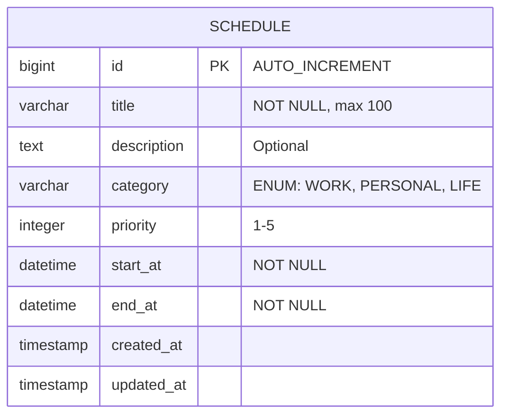

# [LOG] Moyoung Specifier Decision
- **Decision**: Define strict JPA mapping and use Bean Validation (JSR-303).
- **Rationale**: To prevent data corruption at the entry point.
- **Decision**: Add 'Category' and 'Priority' fields to improve UX as requested by Cheongsa.

# Madang-Schedule v2: Implementation Specification

## 1. Database Entity Relationship Diagram (ERD)



## 2. API Endpoints (Swagger-like)

### [POST] /api/v1/schedules
- **Request Body**:
  ```json
  {
    "title": "STARK OS Meeting",
    "description": "Finalizing Phase 3",
    "category": "WORK",
    "priority": 5,
    "startAt": "2026-02-24T10:00:00",
    "endAt": "2026-02-24T11:00:00"
  }
  ```
- **Responses**:
    - `201 Created`: Schedule object.
    - `400 Bad Request`: Validation failure.

---
*Specified by Moyoung - Micro-detail v2.0*
